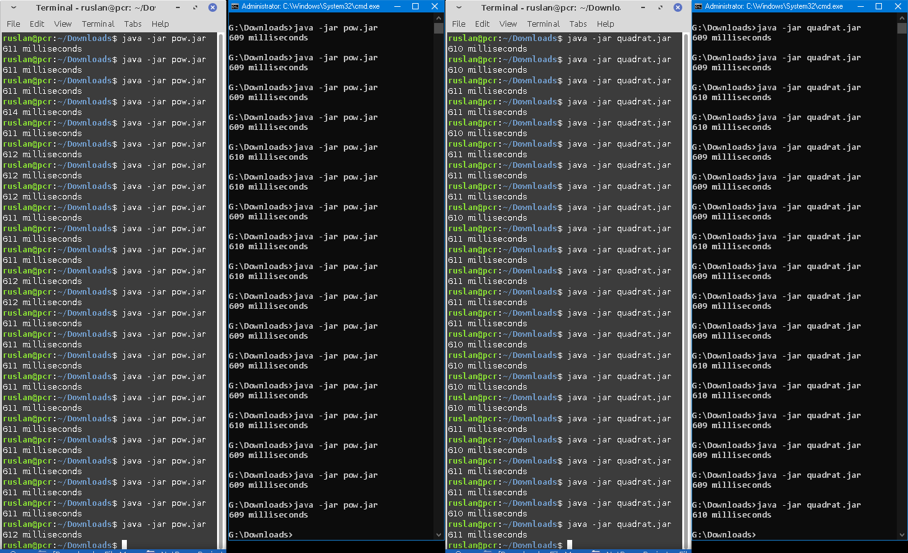
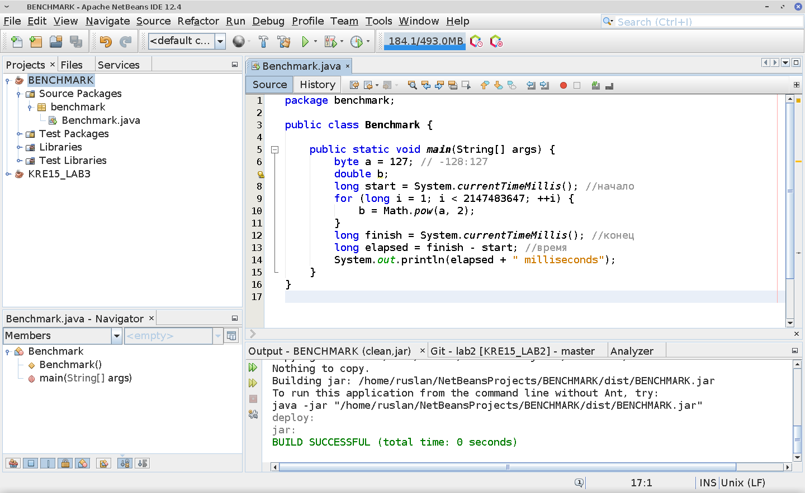

# huhihjhiuh



 # [quadrat.jar](https://raw.githubusercontent.com/kairulla/pow_vs_quadrat/master/quadrat.jar) consist of:
```
package benchmark;

public class Benchmark {
    
    public static void main(String[] args) {
        byte a = 127; // -128:127
        int b;
        long start = System.currentTimeMillis(); //начало
        for (long i = 1; i < 2147483647; ++i) {
            b = a * a;
        }
        long finish = System.currentTimeMillis(); //конец
        long elapsed = finish - start; //время
        System.out.println(elapsed + " milliseconds");
    }    
}

```
 # [pow.jar](https://raw.githubusercontent.com/kairulla/pow_vs_quadrat/master/pow.jar) consist of:
```
package benchmark;

public class Benchmark {
    
    public static void main(String[] args) {
        byte a = 127; // -128:127
        double b;
        long start = System.currentTimeMillis(); //начало
        for (long i = 1; i < 2147483647; ++i) {
            b = Math.pow(a, 2);
        }
        long finish = System.currentTimeMillis(); //конец
        long elapsed = finish - start; //время
        System.out.println(elapsed + " milliseconds");
    }    
}

```
